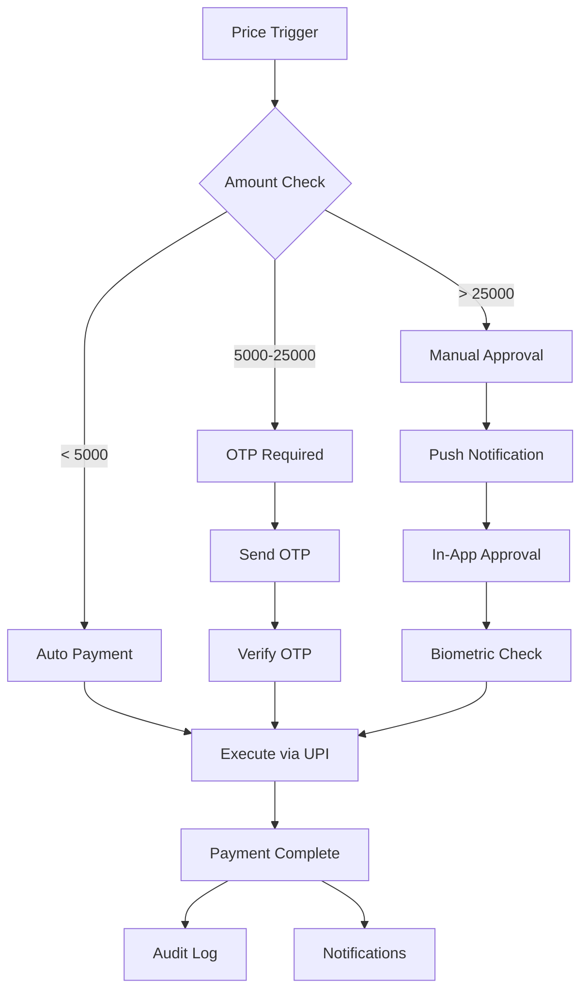

# 🔐 Safe Bank Account Automation for Crypto Trading

## Overview
This guide explains the safest methods to automate bank payments for crypto purchases without compromising security.

## 🛡️ Security Levels (Safest to Riskiest)

### Level 1: Virtual Payment Addresses (VPA) - SAFEST ✅

**How it works:**
- Create dedicated UPI IDs for each exchange
- Set transaction limits per VPA
- No direct bank account access

```javascript
const dedicatedVPAs = {
  binance: "crypto.binance@paytm",
  wazirx: "crypto.wazirx@phonepe", 
  zebpay: "crypto.zebpay@ybl"
}
```

**Setup:**
1. Create separate UPI IDs in different apps
2. Link to a dedicated trading account (not primary)
3. Set daily/monthly limits
4. Enable transaction alerts

**Pros:**
- Can revoke access instantly
- Limited exposure
- Transaction limits protect you
- No API credentials needed

**Cons:**
- Manual approval still needed
- Limited to UPI transaction limits

### Level 2: Dedicated Trading Bank Account 🏦

**Best Practice Setup:**

```javascript
const tradingAccountSetup = {
  bank: "ICICI/HDFC/Axis", // Major banks with good APIs
  accountType: "Savings/Current",
  features: [
    "Separate from primary account",
    "Limited balance maintained",
    "API access enabled",
    "2FA mandatory",
    "IP whitelisting"
  ],
  
  limits: {
    dailyTransfer: 100000,
    perTransaction: 25000,
    monthlyLimit: 1000000
  },
  
  security: {
    notifications: "SMS + Email + App",
    approval: "OTP for amounts > 10000",
    cooling: "5 min between transactions"
  }
}
```

**Implementation:**
1. Open dedicated account for trading
2. Keep only required balance
3. Setup auto-sweep to primary account
4. Enable all security features

### Level 3: Bank API Integration (with OAuth) 🔌

**Secure API Setup:**

```javascript
// Using bank's official APIs with OAuth2
const bankAPIConfig = {
  provider: "ICICI Connect API",
  authentication: "OAuth 2.0",
  scope: "payments:write",
  limits: {
    daily: 200000,
    perRequest: 50000
  },
  security: {
    ipWhitelist: ["your-server-ip"],
    webhook: "https://your-server/payment-confirm",
    encryption: "AES-256"
  }
}

// Example implementation
async function initiateSecurePayment(amount, recipient) {
  // 1. Request OAuth token
  const token = await refreshOAuthToken();
  
  // 2. Create payment request
  const paymentRequest = {
    amount,
    recipient,
    purpose: "CRYPTO-PURCHASE",
    otp: await requestOTP() // Still requires OTP
  };
  
  // 3. Sign request
  const signature = signRequest(paymentRequest);
  
  // 4. Execute with limits
  if (amount <= limits.automatic) {
    return await executePayment(paymentRequest, token);
  } else {
    return await requestManualApproval(paymentRequest);
  }
}
```

### Level 4: Payment Gateway Integration 💳

**Using Payment Aggregators:**

```javascript
const paymentGateways = {
  razorpay: {
    features: ["Route payments", "Virtual accounts", "Webhooks"],
    security: "PCI DSS compliant",
    limits: "Configurable"
  },
  
  cashfree: {
    features: ["Auto collect", "Payouts API", "Beneficiary validation"],
    security: "Bank-grade encryption",
    limits: "Based on KYC"
  },
  
  paytm: {
    features: ["Wallet integration", "Bank transfers", "QR codes"],
    security: "2FA + Device binding",
    limits: "Wallet + Bank limits"
  }
}
```

## 🚨 Safety Mechanisms

### 1. Multi-Layer Approval System

```javascript
const approvalLayers = {
  layer1: {
    // Automatic for small amounts
    condition: "amount <= 5000",
    action: "Auto-approve",
    notification: "SMS alert"
  },
  
  layer2: {
    // Semi-automatic with OTP
    condition: "amount > 5000 && amount <= 25000",
    action: "Require OTP",
    notification: "SMS + Email + App"
  },
  
  layer3: {
    // Manual approval required
    condition: "amount > 25000",
    action: "Manual approval via app",
    notification: "Call + SMS + Email",
    cooling: "10 minutes delay"
  }
}
```

### 2. Smart Contract-Like Rules

```javascript
class PaymentRules {
  constructor() {
    this.rules = [
      {
        name: "Daily Limit",
        check: (amount, history) => {
          const todayTotal = history.getTodayTotal();
          return (todayTotal + amount) <= 100000;
        }
      },
      {
        name: "Unusual Activity",
        check: (amount, history) => {
          const avg = history.getAverageTransaction();
          return amount <= (avg * 3); // Max 3x average
        }
      },
      {
        name: "Time Window",
        check: () => {
          const hour = new Date().getHours();
          return hour >= 9 && hour <= 23; // No midnight transactions
        }
      },
      {
        name: "Recipient Whitelist",
        check: (amount, history, recipient) => {
          return this.whitelistedRecipients.includes(recipient);
        }
      }
    ];
  }
  
  async validatePayment(request) {
    for (const rule of this.rules) {
      if (!await rule.check(request)) {
        throw new Error(`Payment blocked by rule: ${rule.name}`);
      }
    }
    return true;
  }
}
```

### 3. Hardware Security Key Integration

```javascript
// Using FIDO2/WebAuthn for critical operations
const hardwareAuth = {
  device: "YubiKey/Google Titan",
  
  requiredFor: [
    "Adding new recipient",
    "Changing limits",
    "Transactions > 50000",
    "Disabling security features"
  ],
  
  implementation: async (operation) => {
    const challenge = await generateChallenge();
    const assertion = await navigator.credentials.get({
      publicKey: {
        challenge,
        allowCredentials: [{
          id: credentialId,
          type: 'public-key'
        }]
      }
    });
    return verifyAssertion(assertion);
  }
}
```

## 🏗️ Recommended Architecture

### Secure Payment Flow



### Implementation Steps

```javascript
// 1. Setup dedicated infrastructure
const secureSetup = {
  dedicatedServer: {
    provider: "AWS/Google Cloud",
    security: "VPC + Firewall rules",
    access: "VPN only"
  },
  
  database: {
    encryption: "At rest + In transit",
    backup: "Hourly snapshots",
    access: "Read replicas only"
  },
  
  secrets: {
    manager: "AWS Secrets Manager / Hashicorp Vault",
    rotation: "Every 30 days",
    access: "IAM roles only"
  }
}

// 2. Implement payment service
class SecurePaymentService {
  constructor() {
    this.encryptionKey = process.env.PAYMENT_ENCRYPTION_KEY;
    this.hmacSecret = process.env.PAYMENT_HMAC_SECRET;
  }
  
  async initiatePayment(request) {
    // Validate request
    await this.validateRequest(request);
    
    // Check rules
    await this.paymentRules.validatePayment(request);
    
    // Get approval
    const approval = await this.getApproval(request);
    
    // Execute with retry
    return await this.executeWithRetry(request, approval);
  }
  
  async validateRequest(request) {
    // Check signature
    if (!this.verifySignature(request)) {
      throw new Error('Invalid request signature');
    }
    
    // Check timestamp (prevent replay)
    if (Date.now() - request.timestamp > 300000) { // 5 min
      throw new Error('Request expired');
    }
    
    // Validate amounts
    if (request.amount <= 0 || request.amount > 1000000) {
      throw new Error('Invalid amount');
    }
  }
}
```

## 🔔 Monitoring & Alerts

### Real-time Monitoring

```javascript
const monitoringSetup = {
  alerts: [
    {
      trigger: "Failed payment attempt",
      action: "SMS + Email + Block further attempts"
    },
    {
      trigger: "Unusual pattern detected",
      action: "Freeze automation + Manual review"
    },
    {
      trigger: "Large transaction",
      action: "Call + Require voice confirmation"
    }
  ],
  
  dashboard: {
    metrics: [
      "Total daily volume",
      "Success rate",
      "Average transaction time",
      "Failed attempts",
      "Security incidents"
    ],
    
    realtime: true,
    retention: "90 days"
  }
}
```

## 🛠️ Quick Setup Guide

### Option 1: UPI Automation (Safest for beginners)

1. **Create Dedicated UPI**
   ```bash
   Paytm: crypto.trading@paytm
   PhonePe: crypto.trading@ybl
   Google Pay: crypto.trading@okaxis
   ```

2. **Set Limits**
   - Daily limit: ₹100,000
   - Per transaction: ₹25,000
   - Require PIN for all

3. **Link to Exchange**
   - Add as beneficiary
   - Verify with small amount
   - Save for quick access

4. **Automate with Macros**
   ```javascript
   // Using Keyboard Maestro (Mac) or AutoHotkey (Windows)
   const upiMacro = {
     trigger: "Webhook from bot",
     actions: [
       "Open UPI app",
       "Select beneficiary",
       "Enter amount",
       "Confirm with PIN"
     ]
   }
   ```

### Option 2: Bank API (Advanced)

1. **Apply for API Access**
   - Contact bank's corporate banking
   - Provide use case documentation
   - Complete KYC requirements

2. **Implement OAuth Flow**
   ```javascript
   const bankOAuth = {
     authUrl: "https://api.icicibank.com/oauth/authorize",
     tokenUrl: "https://api.icicibank.com/oauth/token",
     scope: "payments transfers balance",
     redirectUri: "https://your-app.com/callback"
   }
   ```

3. **Setup Webhooks**
   - Payment confirmation
   - Failed transaction
   - Daily summary

## ⚡ Emergency Procedures

### If Compromised:

1. **Immediate Actions**
   ```bash
   1. Freeze all UPI IDs via bank app
   2. Change all passwords
   3. Revoke API access
   4. Block beneficiaries
   5. Enable additional OTP
   ```

2. **Damage Control**
   - Check all recent transactions
   - File complaint if needed
   - Update security measures
   - Audit access logs

## 📋 Best Practices Checklist

- [ ] Never use primary bank account
- [ ] Always set transaction limits
- [ ] Enable all available 2FA
- [ ] Use dedicated devices/IPs
- [ ] Regular security audits
- [ ] Keep minimal balance
- [ ] Monitor all transactions
- [ ] Have emergency contacts ready
- [ ] Test with small amounts first
- [ ] Document all integrations

## 🎯 Recommended Solution

For most users, the safest approach is:

1. **Dedicated Bank Account** + **UPI with limits** + **Manual OTP approval**
2. Keep only 1-2 days of trading capital
3. Daily manual top-up based on opportunities
4. All notifications enabled
5. Regular security reviews

This provides good automation while maintaining security! 🔒